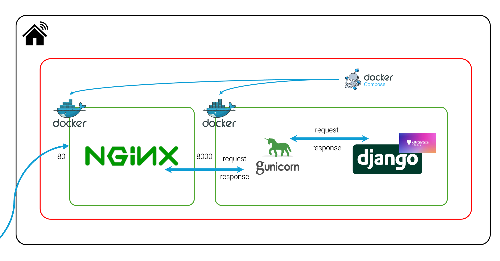

# N.M_AI_BE
- YOLOv8 기반 객체 탐지 모델 API를 제공하는 백엔드 서버
- Django Rest Framework를 사용하여 API 서버 구축

## 시스템 구성도


## 프로젝트 구조
```
N.M_AI_BE
├── foodDetection
│   ├── model
│   │   └── _food_detection.pt
│   ├── service.py
│   ├── urls.py
│   └── views.py
```

## 기술 스택
### 백엔드
<p>
  
  
  
</p>

### 기타
<p>
  
  
  
  
</p>

## 문서
[API 문서](./assets/docs/AI_BE_API_DOCS.pdf)